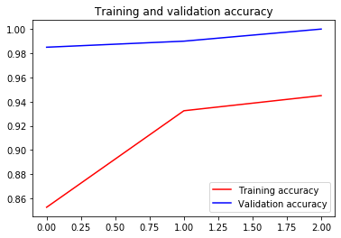

```python
# ATTENTION: Please do not alter any of the provided code in the exercise. Only add your own code where indicated
# ATTENTION: Please do not add or remove any cells in the exercise. The grader will check specific cells based on the cell position.
# ATTENTION: Please use the provided epoch values when training.

# Import all the necessary files!
import os
import tensorflow as tf
from tensorflow.keras import layers
from tensorflow.keras import Model
from os import getcwd
```


```python
path_inception = f"{getcwd()}/../tmp2/inception_v3_weights_tf_dim_ordering_tf_kernels_notop.h5"

# Import the inception model  
from tensorflow.keras.applications.inception_v3 import InceptionV3

# Create an instance of the inception model from the local pre-trained weights
local_weights_file = path_inception

pre_trained_model = InceptionV3(input_shape=(150,150,3),
                                include_top = False,
                                weights = None)

pre_trained_model.load_weights(local_weights_file)

# Make all the layers in the pre-trained model non-trainable
for layer in pre_trained_model.layers:
  # Your Code Here
  layer.trainable = False
# Print the model summary
pre_trained_model.summary()

# Expected Output is extremely large, but should end with:

#batch_normalization_v1_281 (Bat (None, 3, 3, 192)    576         conv2d_281[0][0]                 
#__________________________________________________________________________________________________
#activation_273 (Activation)     (None, 3, 3, 320)    0           batch_normalization_v1_273[0][0] 
#__________________________________________________________________________________________________
#mixed9_1 (Concatenate)          (None, 3, 3, 768)    0           activation_275[0][0]             
#                                                                 activation_276[0][0]             
#__________________________________________________________________________________________________
#concatenate_5 (Concatenate)     (None, 3, 3, 768)    0           activation_279[0][0]             
#                                                                 activation_280[0][0]             
#__________________________________________________________________________________________________
#activation_281 (Activation)     (None, 3, 3, 192)    0           batch_normalization_v1_281[0][0] 
#__________________________________________________________________________________________________
#mixed10 (Concatenate)           (None, 3, 3, 2048)   0           activation_273[0][0]             
#                                                                 mixed9_1[0][0]                   
#                                                                 concatenate_5[0][0]              
#                                                                 activation_281[0][0]             
#==================================================================================================
#Total params: 21,802,784
#Trainable params: 0
#Non-trainable params: 21,802,784
```

    Model: "inception_v3"
    __________________________________________________________________________________________________
    Layer (type)                    Output Shape         Param #     Connected to                     
    ==================================================================================================
    input_2 (InputLayer)            [(None, 150, 150, 3) 0                                            
    __________________________________________________________________________________________________
    conv2d_94 (Conv2D)              (None, 74, 74, 32)   864         input_2[0][0]                    
    __________________________________________________________________________________________________
    batch_normalization_94 (BatchNo (None, 74, 74, 32)   96          conv2d_94[0][0]                  
    __________________________________________________________________________________________________
    activation_94 (Activation)      (None, 74, 74, 32)   0           batch_normalization_94[0][0]     
    __________________________________________________________________________________________________
    conv2d_95 (Conv2D)              (None, 72, 72, 32)   9216        activation_94[0][0]              
    __________________________________________________________________________________________________
    batch_normalization_95 (BatchNo (None, 72, 72, 32)   96          conv2d_95[0][0]                  
    __________________________________________________________________________________________________
    activation_95 (Activation)      (None, 72, 72, 32)   0           batch_normalization_95[0][0]     
    __________________________________________________________________________________________________
    conv2d_96 (Conv2D)              (None, 72, 72, 64)   18432       activation_95[0][0]              
    __________________________________________________________________________________________________
    batch_normalization_96 (BatchNo (None, 72, 72, 64)   192         conv2d_96[0][0]                  
    __________________________________________________________________________________________________
    activation_96 (Activation)      (None, 72, 72, 64)   0           batch_normalization_96[0][0]     
    __________________________________________________________________________________________________
    max_pooling2d_4 (MaxPooling2D)  (None, 35, 35, 64)   0           activation_96[0][0]              
    __________________________________________________________________________________________________
    conv2d_97 (Conv2D)              (None, 35, 35, 80)   5120        max_pooling2d_4[0][0]            
    __________________________________________________________________________________________________
    batch_normalization_97 (BatchNo (None, 35, 35, 80)   240         conv2d_97[0][0]                  
    __________________________________________________________________________________________________
    activation_97 (Activation)      (None, 35, 35, 80)   0           batch_normalization_97[0][0]     
    __________________________________________________________________________________________________
    conv2d_98 (Conv2D)              (None, 33, 33, 192)  138240      activation_97[0][0]              
    __________________________________________________________________________________________________
    batch_normalization_98 (BatchNo (None, 33, 33, 192)  576         conv2d_98[0][0]                  
    __________________________________________________________________________________________________
    activation_98 (Activation)      (None, 33, 33, 192)  0           batch_normalization_98[0][0]     
    __________________________________________________________________________________________________
    max_pooling2d_5 (MaxPooling2D)  (None, 16, 16, 192)  0           activation_98[0][0]              
    __________________________________________________________________________________________________
    conv2d_102 (Conv2D)             (None, 16, 16, 64)   12288       max_pooling2d_5[0][0]            
    __________________________________________________________________________________________________
    batch_normalization_102 (BatchN (None, 16, 16, 64)   192         conv2d_102[0][0]                 
    __________________________________________________________________________________________________
    activation_102 (Activation)     (None, 16, 16, 64)   0           batch_normalization_102[0][0]    
    __________________________________________________________________________________________________
    conv2d_100 (Conv2D)             (None, 16, 16, 48)   9216        max_pooling2d_5[0][0]            
    __________________________________________________________________________________________________
    conv2d_103 (Conv2D)             (None, 16, 16, 96)   55296       activation_102[0][0]             
    __________________________________________________________________________________________________
    batch_normalization_100 (BatchN (None, 16, 16, 48)   144         conv2d_100[0][0]                 
    __________________________________________________________________________________________________
    batch_normalization_103 (BatchN (None, 16, 16, 96)   288         conv2d_103[0][0]                 
    __________________________________________________________________________________________________
    activation_100 (Activation)     (None, 16, 16, 48)   0           batch_normalization_100[0][0]    
    __________________________________________________________________________________________________
    activation_103 (Activation)     (None, 16, 16, 96)   0           batch_normalization_103[0][0]    
    __________________________________________________________________________________________________
    average_pooling2d_9 (AveragePoo (None, 16, 16, 192)  0           max_pooling2d_5[0][0]            
    __________________________________________________________________________________________________
    conv2d_99 (Conv2D)              (None, 16, 16, 64)   12288       max_pooling2d_5[0][0]            
    __________________________________________________________________________________________________
    conv2d_101 (Conv2D)             (None, 16, 16, 64)   76800       activation_100[0][0]             
    __________________________________________________________________________________________________
    conv2d_104 (Conv2D)             (None, 16, 16, 96)   82944       activation_103[0][0]             
    __________________________________________________________________________________________________
    conv2d_105 (Conv2D)             (None, 16, 16, 32)   6144        average_pooling2d_9[0][0]        
    __________________________________________________________________________________________________
    batch_normalization_99 (BatchNo (None, 16, 16, 64)   192         conv2d_99[0][0]                  
    __________________________________________________________________________________________________
    batch_normalization_101 (BatchN (None, 16, 16, 64)   192         conv2d_101[0][0]                 
    __________________________________________________________________________________________________
    batch_normalization_104 (BatchN (None, 16, 16, 96)   288         conv2d_104[0][0]                 
    __________________________________________________________________________________________________
    batch_normalization_105 (BatchN (None, 16, 16, 32)   96          conv2d_105[0][0]                 
    __________________________________________________________________________________________________
    activation_99 (Activation)      (None, 16, 16, 64)   0           batch_normalization_99[0][0]     
    __________________________________________________________________________________________________
    activation_101 (Activation)     (None, 16, 16, 64)   0           batch_normalization_101[0][0]    
    __________________________________________________________________________________________________
    activation_104 (Activation)     (None, 16, 16, 96)   0           batch_normalization_104[0][0]    
    __________________________________________________________________________________________________
    activation_105 (Activation)     (None, 16, 16, 32)   0           batch_normalization_105[0][0]    
    __________________________________________________________________________________________________
    mixed0 (Concatenate)            (None, 16, 16, 256)  0           activation_99[0][0]              
                                                                     activation_101[0][0]             
                                                                     activation_104[0][0]             
                                                                     activation_105[0][0]             
    __________________________________________________________________________________________________
    conv2d_109 (Conv2D)             (None, 16, 16, 64)   16384       mixed0[0][0]                     
    __________________________________________________________________________________________________
    batch_normalization_109 (BatchN (None, 16, 16, 64)   192         conv2d_109[0][0]                 
    __________________________________________________________________________________________________
    activation_109 (Activation)     (None, 16, 16, 64)   0           batch_normalization_109[0][0]    
    __________________________________________________________________________________________________
    conv2d_107 (Conv2D)             (None, 16, 16, 48)   12288       mixed0[0][0]                     
    __________________________________________________________________________________________________
    conv2d_110 (Conv2D)             (None, 16, 16, 96)   55296       activation_109[0][0]             
    __________________________________________________________________________________________________
    batch_normalization_107 (BatchN (None, 16, 16, 48)   144         conv2d_107[0][0]                 
    __________________________________________________________________________________________________
    batch_normalization_110 (BatchN (None, 16, 16, 96)   288         conv2d_110[0][0]                 
    __________________________________________________________________________________________________
    activation_107 (Activation)     (None, 16, 16, 48)   0           batch_normalization_107[0][0]    
    __________________________________________________________________________________________________
    activation_110 (Activation)     (None, 16, 16, 96)   0           batch_normalization_110[0][0]    
    __________________________________________________________________________________________________
    average_pooling2d_10 (AveragePo (None, 16, 16, 256)  0           mixed0[0][0]                     
    __________________________________________________________________________________________________
    conv2d_106 (Conv2D)             (None, 16, 16, 64)   16384       mixed0[0][0]                     
    __________________________________________________________________________________________________
    conv2d_108 (Conv2D)             (None, 16, 16, 64)   76800       activation_107[0][0]             
    __________________________________________________________________________________________________
    conv2d_111 (Conv2D)             (None, 16, 16, 96)   82944       activation_110[0][0]             
    __________________________________________________________________________________________________
    conv2d_112 (Conv2D)             (None, 16, 16, 64)   16384       average_pooling2d_10[0][0]       
    __________________________________________________________________________________________________
    batch_normalization_106 (BatchN (None, 16, 16, 64)   192         conv2d_106[0][0]                 
    __________________________________________________________________________________________________
    batch_normalization_108 (BatchN (None, 16, 16, 64)   192         conv2d_108[0][0]                 
    __________________________________________________________________________________________________
    batch_normalization_111 (BatchN (None, 16, 16, 96)   288         conv2d_111[0][0]                 
    __________________________________________________________________________________________________
    batch_normalization_112 (BatchN (None, 16, 16, 64)   192         conv2d_112[0][0]                 
    __________________________________________________________________________________________________
    activation_106 (Activation)     (None, 16, 16, 64)   0           batch_normalization_106[0][0]    
    __________________________________________________________________________________________________
    activation_108 (Activation)     (None, 16, 16, 64)   0           batch_normalization_108[0][0]    
    __________________________________________________________________________________________________
    activation_111 (Activation)     (None, 16, 16, 96)   0           batch_normalization_111[0][0]    
    __________________________________________________________________________________________________
    activation_112 (Activation)     (None, 16, 16, 64)   0           batch_normalization_112[0][0]    
    __________________________________________________________________________________________________
    mixed1 (Concatenate)            (None, 16, 16, 288)  0           activation_106[0][0]             
                                                                     activation_108[0][0]             
                                                                     activation_111[0][0]             
                                                                     activation_112[0][0]             
    __________________________________________________________________________________________________
    conv2d_116 (Conv2D)             (None, 16, 16, 64)   18432       mixed1[0][0]                     
    __________________________________________________________________________________________________
    batch_normalization_116 (BatchN (None, 16, 16, 64)   192         conv2d_116[0][0]                 
    __________________________________________________________________________________________________
    activation_116 (Activation)     (None, 16, 16, 64)   0           batch_normalization_116[0][0]    
    __________________________________________________________________________________________________
    conv2d_114 (Conv2D)             (None, 16, 16, 48)   13824       mixed1[0][0]                     
    __________________________________________________________________________________________________
    conv2d_117 (Conv2D)             (None, 16, 16, 96)   55296       activation_116[0][0]             
    __________________________________________________________________________________________________
    batch_normalization_114 (BatchN (None, 16, 16, 48)   144         conv2d_114[0][0]                 
    __________________________________________________________________________________________________
    batch_normalization_117 (BatchN (None, 16, 16, 96)   288         conv2d_117[0][0]                 
    __________________________________________________________________________________________________
    activation_114 (Activation)     (None, 16, 16, 48)   0           batch_normalization_114[0][0]    
    __________________________________________________________________________________________________
    activation_117 (Activation)     (None, 16, 16, 96)   0           batch_normalization_117[0][0]    
    __________________________________________________________________________________________________
    average_pooling2d_11 (AveragePo (None, 16, 16, 288)  0           mixed1[0][0]                     
    __________________________________________________________________________________________________
    conv2d_113 (Conv2D)             (None, 16, 16, 64)   18432       mixed1[0][0]                     
    __________________________________________________________________________________________________
    conv2d_115 (Conv2D)             (None, 16, 16, 64)   76800       activation_114[0][0]             
    __________________________________________________________________________________________________
    conv2d_118 (Conv2D)             (None, 16, 16, 96)   82944       activation_117[0][0]             
    __________________________________________________________________________________________________
    conv2d_119 (Conv2D)             (None, 16, 16, 64)   18432       average_pooling2d_11[0][0]       
    __________________________________________________________________________________________________
    batch_normalization_113 (BatchN (None, 16, 16, 64)   192         conv2d_113[0][0]                 
    __________________________________________________________________________________________________
    batch_normalization_115 (BatchN (None, 16, 16, 64)   192         conv2d_115[0][0]                 
    __________________________________________________________________________________________________
    batch_normalization_118 (BatchN (None, 16, 16, 96)   288         conv2d_118[0][0]                 
    __________________________________________________________________________________________________
    batch_normalization_119 (BatchN (None, 16, 16, 64)   192         conv2d_119[0][0]                 
    __________________________________________________________________________________________________
    activation_113 (Activation)     (None, 16, 16, 64)   0           batch_normalization_113[0][0]    
    __________________________________________________________________________________________________
    activation_115 (Activation)     (None, 16, 16, 64)   0           batch_normalization_115[0][0]    
    __________________________________________________________________________________________________
    activation_118 (Activation)     (None, 16, 16, 96)   0           batch_normalization_118[0][0]    
    __________________________________________________________________________________________________
    activation_119 (Activation)     (None, 16, 16, 64)   0           batch_normalization_119[0][0]    
    __________________________________________________________________________________________________
    mixed2 (Concatenate)            (None, 16, 16, 288)  0           activation_113[0][0]             
                                                                     activation_115[0][0]             
                                                                     activation_118[0][0]             
                                                                     activation_119[0][0]             
    __________________________________________________________________________________________________
    conv2d_121 (Conv2D)             (None, 16, 16, 64)   18432       mixed2[0][0]                     
    __________________________________________________________________________________________________
    batch_normalization_121 (BatchN (None, 16, 16, 64)   192         conv2d_121[0][0]                 
    __________________________________________________________________________________________________
    activation_121 (Activation)     (None, 16, 16, 64)   0           batch_normalization_121[0][0]    
    __________________________________________________________________________________________________
    conv2d_122 (Conv2D)             (None, 16, 16, 96)   55296       activation_121[0][0]             
    __________________________________________________________________________________________________
    batch_normalization_122 (BatchN (None, 16, 16, 96)   288         conv2d_122[0][0]                 
    __________________________________________________________________________________________________
    activation_122 (Activation)     (None, 16, 16, 96)   0           batch_normalization_122[0][0]    
    __________________________________________________________________________________________________
    conv2d_120 (Conv2D)             (None, 7, 7, 384)    995328      mixed2[0][0]                     
    __________________________________________________________________________________________________
    conv2d_123 (Conv2D)             (None, 7, 7, 96)     82944       activation_122[0][0]             
    __________________________________________________________________________________________________
    batch_normalization_120 (BatchN (None, 7, 7, 384)    1152        conv2d_120[0][0]                 
    __________________________________________________________________________________________________
    batch_normalization_123 (BatchN (None, 7, 7, 96)     288         conv2d_123[0][0]                 
    __________________________________________________________________________________________________
    activation_120 (Activation)     (None, 7, 7, 384)    0           batch_normalization_120[0][0]    
    __________________________________________________________________________________________________
    activation_123 (Activation)     (None, 7, 7, 96)     0           batch_normalization_123[0][0]    
    __________________________________________________________________________________________________
    max_pooling2d_6 (MaxPooling2D)  (None, 7, 7, 288)    0           mixed2[0][0]                     
    __________________________________________________________________________________________________
    mixed3 (Concatenate)            (None, 7, 7, 768)    0           activation_120[0][0]             
                                                                     activation_123[0][0]             
                                                                     max_pooling2d_6[0][0]            
    __________________________________________________________________________________________________
    conv2d_128 (Conv2D)             (None, 7, 7, 128)    98304       mixed3[0][0]                     
    __________________________________________________________________________________________________
    batch_normalization_128 (BatchN (None, 7, 7, 128)    384         conv2d_128[0][0]                 
    __________________________________________________________________________________________________
    activation_128 (Activation)     (None, 7, 7, 128)    0           batch_normalization_128[0][0]    
    __________________________________________________________________________________________________
    conv2d_129 (Conv2D)             (None, 7, 7, 128)    114688      activation_128[0][0]             
    __________________________________________________________________________________________________
    batch_normalization_129 (BatchN (None, 7, 7, 128)    384         conv2d_129[0][0]                 
    __________________________________________________________________________________________________
    activation_129 (Activation)     (None, 7, 7, 128)    0           batch_normalization_129[0][0]    
    __________________________________________________________________________________________________
    conv2d_125 (Conv2D)             (None, 7, 7, 128)    98304       mixed3[0][0]                     
    __________________________________________________________________________________________________
    conv2d_130 (Conv2D)             (None, 7, 7, 128)    114688      activation_129[0][0]             
    __________________________________________________________________________________________________
    batch_normalization_125 (BatchN (None, 7, 7, 128)    384         conv2d_125[0][0]                 
    __________________________________________________________________________________________________
    batch_normalization_130 (BatchN (None, 7, 7, 128)    384         conv2d_130[0][0]                 
    __________________________________________________________________________________________________
    activation_125 (Activation)     (None, 7, 7, 128)    0           batch_normalization_125[0][0]    
    __________________________________________________________________________________________________
    activation_130 (Activation)     (None, 7, 7, 128)    0           batch_normalization_130[0][0]    
    __________________________________________________________________________________________________
    conv2d_126 (Conv2D)             (None, 7, 7, 128)    114688      activation_125[0][0]             
    __________________________________________________________________________________________________
    conv2d_131 (Conv2D)             (None, 7, 7, 128)    114688      activation_130[0][0]             
    __________________________________________________________________________________________________
    batch_normalization_126 (BatchN (None, 7, 7, 128)    384         conv2d_126[0][0]                 
    __________________________________________________________________________________________________
    batch_normalization_131 (BatchN (None, 7, 7, 128)    384         conv2d_131[0][0]                 
    __________________________________________________________________________________________________
    activation_126 (Activation)     (None, 7, 7, 128)    0           batch_normalization_126[0][0]    
    __________________________________________________________________________________________________
    activation_131 (Activation)     (None, 7, 7, 128)    0           batch_normalization_131[0][0]    
    __________________________________________________________________________________________________
    average_pooling2d_12 (AveragePo (None, 7, 7, 768)    0           mixed3[0][0]                     
    __________________________________________________________________________________________________
    conv2d_124 (Conv2D)             (None, 7, 7, 192)    147456      mixed3[0][0]                     
    __________________________________________________________________________________________________
    conv2d_127 (Conv2D)             (None, 7, 7, 192)    172032      activation_126[0][0]             
    __________________________________________________________________________________________________
    conv2d_132 (Conv2D)             (None, 7, 7, 192)    172032      activation_131[0][0]             
    __________________________________________________________________________________________________
    conv2d_133 (Conv2D)             (None, 7, 7, 192)    147456      average_pooling2d_12[0][0]       
    __________________________________________________________________________________________________
    batch_normalization_124 (BatchN (None, 7, 7, 192)    576         conv2d_124[0][0]                 
    __________________________________________________________________________________________________
    batch_normalization_127 (BatchN (None, 7, 7, 192)    576         conv2d_127[0][0]                 
    __________________________________________________________________________________________________
    batch_normalization_132 (BatchN (None, 7, 7, 192)    576         conv2d_132[0][0]                 
    __________________________________________________________________________________________________
    batch_normalization_133 (BatchN (None, 7, 7, 192)    576         conv2d_133[0][0]                 
    __________________________________________________________________________________________________
    activation_124 (Activation)     (None, 7, 7, 192)    0           batch_normalization_124[0][0]    
    __________________________________________________________________________________________________
    activation_127 (Activation)     (None, 7, 7, 192)    0           batch_normalization_127[0][0]    
    __________________________________________________________________________________________________
    activation_132 (Activation)     (None, 7, 7, 192)    0           batch_normalization_132[0][0]    
    __________________________________________________________________________________________________
    activation_133 (Activation)     (None, 7, 7, 192)    0           batch_normalization_133[0][0]    
    __________________________________________________________________________________________________
    mixed4 (Concatenate)            (None, 7, 7, 768)    0           activation_124[0][0]             
                                                                     activation_127[0][0]             
                                                                     activation_132[0][0]             
                                                                     activation_133[0][0]             
    __________________________________________________________________________________________________
    conv2d_138 (Conv2D)             (None, 7, 7, 160)    122880      mixed4[0][0]                     
    __________________________________________________________________________________________________
    batch_normalization_138 (BatchN (None, 7, 7, 160)    480         conv2d_138[0][0]                 
    __________________________________________________________________________________________________
    activation_138 (Activation)     (None, 7, 7, 160)    0           batch_normalization_138[0][0]    
    __________________________________________________________________________________________________
    conv2d_139 (Conv2D)             (None, 7, 7, 160)    179200      activation_138[0][0]             
    __________________________________________________________________________________________________
    batch_normalization_139 (BatchN (None, 7, 7, 160)    480         conv2d_139[0][0]                 
    __________________________________________________________________________________________________
    activation_139 (Activation)     (None, 7, 7, 160)    0           batch_normalization_139[0][0]    
    __________________________________________________________________________________________________
    conv2d_135 (Conv2D)             (None, 7, 7, 160)    122880      mixed4[0][0]                     
    __________________________________________________________________________________________________
    conv2d_140 (Conv2D)             (None, 7, 7, 160)    179200      activation_139[0][0]             
    __________________________________________________________________________________________________
    batch_normalization_135 (BatchN (None, 7, 7, 160)    480         conv2d_135[0][0]                 
    __________________________________________________________________________________________________
    batch_normalization_140 (BatchN (None, 7, 7, 160)    480         conv2d_140[0][0]                 
    __________________________________________________________________________________________________
    activation_135 (Activation)     (None, 7, 7, 160)    0           batch_normalization_135[0][0]    
    __________________________________________________________________________________________________
    activation_140 (Activation)     (None, 7, 7, 160)    0           batch_normalization_140[0][0]    
    __________________________________________________________________________________________________
    conv2d_136 (Conv2D)             (None, 7, 7, 160)    179200      activation_135[0][0]             
    __________________________________________________________________________________________________
    conv2d_141 (Conv2D)             (None, 7, 7, 160)    179200      activation_140[0][0]             
    __________________________________________________________________________________________________
    batch_normalization_136 (BatchN (None, 7, 7, 160)    480         conv2d_136[0][0]                 
    __________________________________________________________________________________________________
    batch_normalization_141 (BatchN (None, 7, 7, 160)    480         conv2d_141[0][0]                 
    __________________________________________________________________________________________________
    activation_136 (Activation)     (None, 7, 7, 160)    0           batch_normalization_136[0][0]    
    __________________________________________________________________________________________________
    activation_141 (Activation)     (None, 7, 7, 160)    0           batch_normalization_141[0][0]    
    __________________________________________________________________________________________________
    average_pooling2d_13 (AveragePo (None, 7, 7, 768)    0           mixed4[0][0]                     
    __________________________________________________________________________________________________
    conv2d_134 (Conv2D)             (None, 7, 7, 192)    147456      mixed4[0][0]                     
    __________________________________________________________________________________________________
    conv2d_137 (Conv2D)             (None, 7, 7, 192)    215040      activation_136[0][0]             
    __________________________________________________________________________________________________
    conv2d_142 (Conv2D)             (None, 7, 7, 192)    215040      activation_141[0][0]             
    __________________________________________________________________________________________________
    conv2d_143 (Conv2D)             (None, 7, 7, 192)    147456      average_pooling2d_13[0][0]       
    __________________________________________________________________________________________________
    batch_normalization_134 (BatchN (None, 7, 7, 192)    576         conv2d_134[0][0]                 
    __________________________________________________________________________________________________
    batch_normalization_137 (BatchN (None, 7, 7, 192)    576         conv2d_137[0][0]                 
    __________________________________________________________________________________________________
    batch_normalization_142 (BatchN (None, 7, 7, 192)    576         conv2d_142[0][0]                 
    __________________________________________________________________________________________________
    batch_normalization_143 (BatchN (None, 7, 7, 192)    576         conv2d_143[0][0]                 
    __________________________________________________________________________________________________
    activation_134 (Activation)     (None, 7, 7, 192)    0           batch_normalization_134[0][0]    
    __________________________________________________________________________________________________
    activation_137 (Activation)     (None, 7, 7, 192)    0           batch_normalization_137[0][0]    
    __________________________________________________________________________________________________
    activation_142 (Activation)     (None, 7, 7, 192)    0           batch_normalization_142[0][0]    
    __________________________________________________________________________________________________
    activation_143 (Activation)     (None, 7, 7, 192)    0           batch_normalization_143[0][0]    
    __________________________________________________________________________________________________
    mixed5 (Concatenate)            (None, 7, 7, 768)    0           activation_134[0][0]             
                                                                     activation_137[0][0]             
                                                                     activation_142[0][0]             
                                                                     activation_143[0][0]             
    __________________________________________________________________________________________________
    conv2d_148 (Conv2D)             (None, 7, 7, 160)    122880      mixed5[0][0]                     
    __________________________________________________________________________________________________
    batch_normalization_148 (BatchN (None, 7, 7, 160)    480         conv2d_148[0][0]                 
    __________________________________________________________________________________________________
    activation_148 (Activation)     (None, 7, 7, 160)    0           batch_normalization_148[0][0]    
    __________________________________________________________________________________________________
    conv2d_149 (Conv2D)             (None, 7, 7, 160)    179200      activation_148[0][0]             
    __________________________________________________________________________________________________
    batch_normalization_149 (BatchN (None, 7, 7, 160)    480         conv2d_149[0][0]                 
    __________________________________________________________________________________________________
    activation_149 (Activation)     (None, 7, 7, 160)    0           batch_normalization_149[0][0]    
    __________________________________________________________________________________________________
    conv2d_145 (Conv2D)             (None, 7, 7, 160)    122880      mixed5[0][0]                     
    __________________________________________________________________________________________________
    conv2d_150 (Conv2D)             (None, 7, 7, 160)    179200      activation_149[0][0]             
    __________________________________________________________________________________________________
    batch_normalization_145 (BatchN (None, 7, 7, 160)    480         conv2d_145[0][0]                 
    __________________________________________________________________________________________________
    batch_normalization_150 (BatchN (None, 7, 7, 160)    480         conv2d_150[0][0]                 
    __________________________________________________________________________________________________
    activation_145 (Activation)     (None, 7, 7, 160)    0           batch_normalization_145[0][0]    
    __________________________________________________________________________________________________
    activation_150 (Activation)     (None, 7, 7, 160)    0           batch_normalization_150[0][0]    
    __________________________________________________________________________________________________
    conv2d_146 (Conv2D)             (None, 7, 7, 160)    179200      activation_145[0][0]             
    __________________________________________________________________________________________________
    conv2d_151 (Conv2D)             (None, 7, 7, 160)    179200      activation_150[0][0]             
    __________________________________________________________________________________________________
    batch_normalization_146 (BatchN (None, 7, 7, 160)    480         conv2d_146[0][0]                 
    __________________________________________________________________________________________________
    batch_normalization_151 (BatchN (None, 7, 7, 160)    480         conv2d_151[0][0]                 
    __________________________________________________________________________________________________
    activation_146 (Activation)     (None, 7, 7, 160)    0           batch_normalization_146[0][0]    
    __________________________________________________________________________________________________
    activation_151 (Activation)     (None, 7, 7, 160)    0           batch_normalization_151[0][0]    
    __________________________________________________________________________________________________
    average_pooling2d_14 (AveragePo (None, 7, 7, 768)    0           mixed5[0][0]                     
    __________________________________________________________________________________________________
    conv2d_144 (Conv2D)             (None, 7, 7, 192)    147456      mixed5[0][0]                     
    __________________________________________________________________________________________________
    conv2d_147 (Conv2D)             (None, 7, 7, 192)    215040      activation_146[0][0]             
    __________________________________________________________________________________________________
    conv2d_152 (Conv2D)             (None, 7, 7, 192)    215040      activation_151[0][0]             
    __________________________________________________________________________________________________
    conv2d_153 (Conv2D)             (None, 7, 7, 192)    147456      average_pooling2d_14[0][0]       
    __________________________________________________________________________________________________
    batch_normalization_144 (BatchN (None, 7, 7, 192)    576         conv2d_144[0][0]                 
    __________________________________________________________________________________________________
    batch_normalization_147 (BatchN (None, 7, 7, 192)    576         conv2d_147[0][0]                 
    __________________________________________________________________________________________________
    batch_normalization_152 (BatchN (None, 7, 7, 192)    576         conv2d_152[0][0]                 
    __________________________________________________________________________________________________
    batch_normalization_153 (BatchN (None, 7, 7, 192)    576         conv2d_153[0][0]                 
    __________________________________________________________________________________________________
    activation_144 (Activation)     (None, 7, 7, 192)    0           batch_normalization_144[0][0]    
    __________________________________________________________________________________________________
    activation_147 (Activation)     (None, 7, 7, 192)    0           batch_normalization_147[0][0]    
    __________________________________________________________________________________________________
    activation_152 (Activation)     (None, 7, 7, 192)    0           batch_normalization_152[0][0]    
    __________________________________________________________________________________________________
    activation_153 (Activation)     (None, 7, 7, 192)    0           batch_normalization_153[0][0]    
    __________________________________________________________________________________________________
    mixed6 (Concatenate)            (None, 7, 7, 768)    0           activation_144[0][0]             
                                                                     activation_147[0][0]             
                                                                     activation_152[0][0]             
                                                                     activation_153[0][0]             
    __________________________________________________________________________________________________
    conv2d_158 (Conv2D)             (None, 7, 7, 192)    147456      mixed6[0][0]                     
    __________________________________________________________________________________________________
    batch_normalization_158 (BatchN (None, 7, 7, 192)    576         conv2d_158[0][0]                 
    __________________________________________________________________________________________________
    activation_158 (Activation)     (None, 7, 7, 192)    0           batch_normalization_158[0][0]    
    __________________________________________________________________________________________________
    conv2d_159 (Conv2D)             (None, 7, 7, 192)    258048      activation_158[0][0]             
    __________________________________________________________________________________________________
    batch_normalization_159 (BatchN (None, 7, 7, 192)    576         conv2d_159[0][0]                 
    __________________________________________________________________________________________________
    activation_159 (Activation)     (None, 7, 7, 192)    0           batch_normalization_159[0][0]    
    __________________________________________________________________________________________________
    conv2d_155 (Conv2D)             (None, 7, 7, 192)    147456      mixed6[0][0]                     
    __________________________________________________________________________________________________
    conv2d_160 (Conv2D)             (None, 7, 7, 192)    258048      activation_159[0][0]             
    __________________________________________________________________________________________________
    batch_normalization_155 (BatchN (None, 7, 7, 192)    576         conv2d_155[0][0]                 
    __________________________________________________________________________________________________
    batch_normalization_160 (BatchN (None, 7, 7, 192)    576         conv2d_160[0][0]                 
    __________________________________________________________________________________________________
    activation_155 (Activation)     (None, 7, 7, 192)    0           batch_normalization_155[0][0]    
    __________________________________________________________________________________________________
    activation_160 (Activation)     (None, 7, 7, 192)    0           batch_normalization_160[0][0]    
    __________________________________________________________________________________________________
    conv2d_156 (Conv2D)             (None, 7, 7, 192)    258048      activation_155[0][0]             
    __________________________________________________________________________________________________
    conv2d_161 (Conv2D)             (None, 7, 7, 192)    258048      activation_160[0][0]             
    __________________________________________________________________________________________________
    batch_normalization_156 (BatchN (None, 7, 7, 192)    576         conv2d_156[0][0]                 
    __________________________________________________________________________________________________
    batch_normalization_161 (BatchN (None, 7, 7, 192)    576         conv2d_161[0][0]                 
    __________________________________________________________________________________________________
    activation_156 (Activation)     (None, 7, 7, 192)    0           batch_normalization_156[0][0]    
    __________________________________________________________________________________________________
    activation_161 (Activation)     (None, 7, 7, 192)    0           batch_normalization_161[0][0]    
    __________________________________________________________________________________________________
    average_pooling2d_15 (AveragePo (None, 7, 7, 768)    0           mixed6[0][0]                     
    __________________________________________________________________________________________________
    conv2d_154 (Conv2D)             (None, 7, 7, 192)    147456      mixed6[0][0]                     
    __________________________________________________________________________________________________
    conv2d_157 (Conv2D)             (None, 7, 7, 192)    258048      activation_156[0][0]             
    __________________________________________________________________________________________________
    conv2d_162 (Conv2D)             (None, 7, 7, 192)    258048      activation_161[0][0]             
    __________________________________________________________________________________________________
    conv2d_163 (Conv2D)             (None, 7, 7, 192)    147456      average_pooling2d_15[0][0]       
    __________________________________________________________________________________________________
    batch_normalization_154 (BatchN (None, 7, 7, 192)    576         conv2d_154[0][0]                 
    __________________________________________________________________________________________________
    batch_normalization_157 (BatchN (None, 7, 7, 192)    576         conv2d_157[0][0]                 
    __________________________________________________________________________________________________
    batch_normalization_162 (BatchN (None, 7, 7, 192)    576         conv2d_162[0][0]                 
    __________________________________________________________________________________________________
    batch_normalization_163 (BatchN (None, 7, 7, 192)    576         conv2d_163[0][0]                 
    __________________________________________________________________________________________________
    activation_154 (Activation)     (None, 7, 7, 192)    0           batch_normalization_154[0][0]    
    __________________________________________________________________________________________________
    activation_157 (Activation)     (None, 7, 7, 192)    0           batch_normalization_157[0][0]    
    __________________________________________________________________________________________________
    activation_162 (Activation)     (None, 7, 7, 192)    0           batch_normalization_162[0][0]    
    __________________________________________________________________________________________________
    activation_163 (Activation)     (None, 7, 7, 192)    0           batch_normalization_163[0][0]    
    __________________________________________________________________________________________________
    mixed7 (Concatenate)            (None, 7, 7, 768)    0           activation_154[0][0]             
                                                                     activation_157[0][0]             
                                                                     activation_162[0][0]             
                                                                     activation_163[0][0]             
    __________________________________________________________________________________________________
    conv2d_166 (Conv2D)             (None, 7, 7, 192)    147456      mixed7[0][0]                     
    __________________________________________________________________________________________________
    batch_normalization_166 (BatchN (None, 7, 7, 192)    576         conv2d_166[0][0]                 
    __________________________________________________________________________________________________
    activation_166 (Activation)     (None, 7, 7, 192)    0           batch_normalization_166[0][0]    
    __________________________________________________________________________________________________
    conv2d_167 (Conv2D)             (None, 7, 7, 192)    258048      activation_166[0][0]             
    __________________________________________________________________________________________________
    batch_normalization_167 (BatchN (None, 7, 7, 192)    576         conv2d_167[0][0]                 
    __________________________________________________________________________________________________
    activation_167 (Activation)     (None, 7, 7, 192)    0           batch_normalization_167[0][0]    
    __________________________________________________________________________________________________
    conv2d_164 (Conv2D)             (None, 7, 7, 192)    147456      mixed7[0][0]                     
    __________________________________________________________________________________________________
    conv2d_168 (Conv2D)             (None, 7, 7, 192)    258048      activation_167[0][0]             
    __________________________________________________________________________________________________
    batch_normalization_164 (BatchN (None, 7, 7, 192)    576         conv2d_164[0][0]                 
    __________________________________________________________________________________________________
    batch_normalization_168 (BatchN (None, 7, 7, 192)    576         conv2d_168[0][0]                 
    __________________________________________________________________________________________________
    activation_164 (Activation)     (None, 7, 7, 192)    0           batch_normalization_164[0][0]    
    __________________________________________________________________________________________________
    activation_168 (Activation)     (None, 7, 7, 192)    0           batch_normalization_168[0][0]    
    __________________________________________________________________________________________________
    conv2d_165 (Conv2D)             (None, 3, 3, 320)    552960      activation_164[0][0]             
    __________________________________________________________________________________________________
    conv2d_169 (Conv2D)             (None, 3, 3, 192)    331776      activation_168[0][0]             
    __________________________________________________________________________________________________
    batch_normalization_165 (BatchN (None, 3, 3, 320)    960         conv2d_165[0][0]                 
    __________________________________________________________________________________________________
    batch_normalization_169 (BatchN (None, 3, 3, 192)    576         conv2d_169[0][0]                 
    __________________________________________________________________________________________________
    activation_165 (Activation)     (None, 3, 3, 320)    0           batch_normalization_165[0][0]    
    __________________________________________________________________________________________________
    activation_169 (Activation)     (None, 3, 3, 192)    0           batch_normalization_169[0][0]    
    __________________________________________________________________________________________________
    max_pooling2d_7 (MaxPooling2D)  (None, 3, 3, 768)    0           mixed7[0][0]                     
    __________________________________________________________________________________________________
    mixed8 (Concatenate)            (None, 3, 3, 1280)   0           activation_165[0][0]             
                                                                     activation_169[0][0]             
                                                                     max_pooling2d_7[0][0]            
    __________________________________________________________________________________________________
    conv2d_174 (Conv2D)             (None, 3, 3, 448)    573440      mixed8[0][0]                     
    __________________________________________________________________________________________________
    batch_normalization_174 (BatchN (None, 3, 3, 448)    1344        conv2d_174[0][0]                 
    __________________________________________________________________________________________________
    activation_174 (Activation)     (None, 3, 3, 448)    0           batch_normalization_174[0][0]    
    __________________________________________________________________________________________________
    conv2d_171 (Conv2D)             (None, 3, 3, 384)    491520      mixed8[0][0]                     
    __________________________________________________________________________________________________
    conv2d_175 (Conv2D)             (None, 3, 3, 384)    1548288     activation_174[0][0]             
    __________________________________________________________________________________________________
    batch_normalization_171 (BatchN (None, 3, 3, 384)    1152        conv2d_171[0][0]                 
    __________________________________________________________________________________________________
    batch_normalization_175 (BatchN (None, 3, 3, 384)    1152        conv2d_175[0][0]                 
    __________________________________________________________________________________________________
    activation_171 (Activation)     (None, 3, 3, 384)    0           batch_normalization_171[0][0]    
    __________________________________________________________________________________________________
    activation_175 (Activation)     (None, 3, 3, 384)    0           batch_normalization_175[0][0]    
    __________________________________________________________________________________________________
    conv2d_172 (Conv2D)             (None, 3, 3, 384)    442368      activation_171[0][0]             
    __________________________________________________________________________________________________
    conv2d_173 (Conv2D)             (None, 3, 3, 384)    442368      activation_171[0][0]             
    __________________________________________________________________________________________________
    conv2d_176 (Conv2D)             (None, 3, 3, 384)    442368      activation_175[0][0]             
    __________________________________________________________________________________________________
    conv2d_177 (Conv2D)             (None, 3, 3, 384)    442368      activation_175[0][0]             
    __________________________________________________________________________________________________
    average_pooling2d_16 (AveragePo (None, 3, 3, 1280)   0           mixed8[0][0]                     
    __________________________________________________________________________________________________
    conv2d_170 (Conv2D)             (None, 3, 3, 320)    409600      mixed8[0][0]                     
    __________________________________________________________________________________________________
    batch_normalization_172 (BatchN (None, 3, 3, 384)    1152        conv2d_172[0][0]                 
    __________________________________________________________________________________________________
    batch_normalization_173 (BatchN (None, 3, 3, 384)    1152        conv2d_173[0][0]                 
    __________________________________________________________________________________________________
    batch_normalization_176 (BatchN (None, 3, 3, 384)    1152        conv2d_176[0][0]                 
    __________________________________________________________________________________________________
    batch_normalization_177 (BatchN (None, 3, 3, 384)    1152        conv2d_177[0][0]                 
    __________________________________________________________________________________________________
    conv2d_178 (Conv2D)             (None, 3, 3, 192)    245760      average_pooling2d_16[0][0]       
    __________________________________________________________________________________________________
    batch_normalization_170 (BatchN (None, 3, 3, 320)    960         conv2d_170[0][0]                 
    __________________________________________________________________________________________________
    activation_172 (Activation)     (None, 3, 3, 384)    0           batch_normalization_172[0][0]    
    __________________________________________________________________________________________________
    activation_173 (Activation)     (None, 3, 3, 384)    0           batch_normalization_173[0][0]    
    __________________________________________________________________________________________________
    activation_176 (Activation)     (None, 3, 3, 384)    0           batch_normalization_176[0][0]    
    __________________________________________________________________________________________________
    activation_177 (Activation)     (None, 3, 3, 384)    0           batch_normalization_177[0][0]    
    __________________________________________________________________________________________________
    batch_normalization_178 (BatchN (None, 3, 3, 192)    576         conv2d_178[0][0]                 
    __________________________________________________________________________________________________
    activation_170 (Activation)     (None, 3, 3, 320)    0           batch_normalization_170[0][0]    
    __________________________________________________________________________________________________
    mixed9_0 (Concatenate)          (None, 3, 3, 768)    0           activation_172[0][0]             
                                                                     activation_173[0][0]             
    __________________________________________________________________________________________________
    concatenate_2 (Concatenate)     (None, 3, 3, 768)    0           activation_176[0][0]             
                                                                     activation_177[0][0]             
    __________________________________________________________________________________________________
    activation_178 (Activation)     (None, 3, 3, 192)    0           batch_normalization_178[0][0]    
    __________________________________________________________________________________________________
    mixed9 (Concatenate)            (None, 3, 3, 2048)   0           activation_170[0][0]             
                                                                     mixed9_0[0][0]                   
                                                                     concatenate_2[0][0]              
                                                                     activation_178[0][0]             
    __________________________________________________________________________________________________
    conv2d_183 (Conv2D)             (None, 3, 3, 448)    917504      mixed9[0][0]                     
    __________________________________________________________________________________________________
    batch_normalization_183 (BatchN (None, 3, 3, 448)    1344        conv2d_183[0][0]                 
    __________________________________________________________________________________________________
    activation_183 (Activation)     (None, 3, 3, 448)    0           batch_normalization_183[0][0]    
    __________________________________________________________________________________________________
    conv2d_180 (Conv2D)             (None, 3, 3, 384)    786432      mixed9[0][0]                     
    __________________________________________________________________________________________________
    conv2d_184 (Conv2D)             (None, 3, 3, 384)    1548288     activation_183[0][0]             
    __________________________________________________________________________________________________
    batch_normalization_180 (BatchN (None, 3, 3, 384)    1152        conv2d_180[0][0]                 
    __________________________________________________________________________________________________
    batch_normalization_184 (BatchN (None, 3, 3, 384)    1152        conv2d_184[0][0]                 
    __________________________________________________________________________________________________
    activation_180 (Activation)     (None, 3, 3, 384)    0           batch_normalization_180[0][0]    
    __________________________________________________________________________________________________
    activation_184 (Activation)     (None, 3, 3, 384)    0           batch_normalization_184[0][0]    
    __________________________________________________________________________________________________
    conv2d_181 (Conv2D)             (None, 3, 3, 384)    442368      activation_180[0][0]             
    __________________________________________________________________________________________________
    conv2d_182 (Conv2D)             (None, 3, 3, 384)    442368      activation_180[0][0]             
    __________________________________________________________________________________________________
    conv2d_185 (Conv2D)             (None, 3, 3, 384)    442368      activation_184[0][0]             
    __________________________________________________________________________________________________
    conv2d_186 (Conv2D)             (None, 3, 3, 384)    442368      activation_184[0][0]             
    __________________________________________________________________________________________________
    average_pooling2d_17 (AveragePo (None, 3, 3, 2048)   0           mixed9[0][0]                     
    __________________________________________________________________________________________________
    conv2d_179 (Conv2D)             (None, 3, 3, 320)    655360      mixed9[0][0]                     
    __________________________________________________________________________________________________
    batch_normalization_181 (BatchN (None, 3, 3, 384)    1152        conv2d_181[0][0]                 
    __________________________________________________________________________________________________
    batch_normalization_182 (BatchN (None, 3, 3, 384)    1152        conv2d_182[0][0]                 
    __________________________________________________________________________________________________
    batch_normalization_185 (BatchN (None, 3, 3, 384)    1152        conv2d_185[0][0]                 
    __________________________________________________________________________________________________
    batch_normalization_186 (BatchN (None, 3, 3, 384)    1152        conv2d_186[0][0]                 
    __________________________________________________________________________________________________
    conv2d_187 (Conv2D)             (None, 3, 3, 192)    393216      average_pooling2d_17[0][0]       
    __________________________________________________________________________________________________
    batch_normalization_179 (BatchN (None, 3, 3, 320)    960         conv2d_179[0][0]                 
    __________________________________________________________________________________________________
    activation_181 (Activation)     (None, 3, 3, 384)    0           batch_normalization_181[0][0]    
    __________________________________________________________________________________________________
    activation_182 (Activation)     (None, 3, 3, 384)    0           batch_normalization_182[0][0]    
    __________________________________________________________________________________________________
    activation_185 (Activation)     (None, 3, 3, 384)    0           batch_normalization_185[0][0]    
    __________________________________________________________________________________________________
    activation_186 (Activation)     (None, 3, 3, 384)    0           batch_normalization_186[0][0]    
    __________________________________________________________________________________________________
    batch_normalization_187 (BatchN (None, 3, 3, 192)    576         conv2d_187[0][0]                 
    __________________________________________________________________________________________________
    activation_179 (Activation)     (None, 3, 3, 320)    0           batch_normalization_179[0][0]    
    __________________________________________________________________________________________________
    mixed9_1 (Concatenate)          (None, 3, 3, 768)    0           activation_181[0][0]             
                                                                     activation_182[0][0]             
    __________________________________________________________________________________________________
    concatenate_3 (Concatenate)     (None, 3, 3, 768)    0           activation_185[0][0]             
                                                                     activation_186[0][0]             
    __________________________________________________________________________________________________
    activation_187 (Activation)     (None, 3, 3, 192)    0           batch_normalization_187[0][0]    
    __________________________________________________________________________________________________
    mixed10 (Concatenate)           (None, 3, 3, 2048)   0           activation_179[0][0]             
                                                                     mixed9_1[0][0]                   
                                                                     concatenate_3[0][0]              
                                                                     activation_187[0][0]             
    ==================================================================================================
    Total params: 21,802,784
    Trainable params: 0
    Non-trainable params: 21,802,784
    __________________________________________________________________________________________________


```python
last_layer = pre_trained_model.get_layer('mixed7')
print('last layer output shape: ', last_layer.output_shape)
last_output = last_layer.output

# Expected Output:
# ('last layer output shape: ', (None, 7, 7, 768))
```

    last layer output shape:  (None, 7, 7, 768)


```python
# Define a Callback class that stops training once accuracy reaches 97.0%
class myCallback(tf.keras.callbacks.Callback):
  def on_epoch_end(self, epoch, logs={}):
    if(logs.get('acc')>0.97):
      print("\nReached 97.0% accuracy so cancelling training!")
      self.model.stop_training = True

      
```


```python
from tensorflow.keras.optimizers import RMSprop

# Flatten the output layer to 1 dimension
x = layers.Flatten()(last_output)
# Add a fully connected layer with 1,024 hidden units and ReLU activation
x = layers.Dense(1024, activation='relu')(x)
# Add a dropout rate of 0.2
x = layers.Dropout(0.2)(x)                  
# Add a final sigmoid layer for classification
x = layers.Dense  (1,activation='sigmoid')(x)           

model = Model( pre_trained_model.input, x) 

model.compile(optimizer = RMSprop(lr=0.0001), 
              loss = 'binary_crossentropy', 
              metrics = ['accuracy'])

model.summary()

# Expected output will be large. Last few lines should be:

# mixed7 (Concatenate)            (None, 7, 7, 768)    0           activation_248[0][0]             
#                                                                  activation_251[0][0]             
#                                                                  activation_256[0][0]             
#                                                                  activation_257[0][0]             
# __________________________________________________________________________________________________
# flatten_4 (Flatten)             (None, 37632)        0           mixed7[0][0]                     
# __________________________________________________________________________________________________
# dense_8 (Dense)                 (None, 1024)         38536192    flatten_4[0][0]                  
# __________________________________________________________________________________________________
# dropout_4 (Dropout)             (None, 1024)         0           dense_8[0][0]                    
# __________________________________________________________________________________________________
# dense_9 (Dense)                 (None, 1)            1025        dropout_4[0][0]                  
# ==================================================================================================
# Total params: 47,512,481
# Trainable params: 38,537,217
# Non-trainable params: 8,975,264

```

    Model: "model_1"
    __________________________________________________________________________________________________
    Layer (type)                    Output Shape         Param #     Connected to                     
    ==================================================================================================
    input_2 (InputLayer)            [(None, 150, 150, 3) 0                                            
    __________________________________________________________________________________________________
    conv2d_94 (Conv2D)              (None, 74, 74, 32)   864         input_2[0][0]                    
    __________________________________________________________________________________________________
    batch_normalization_94 (BatchNo (None, 74, 74, 32)   96          conv2d_94[0][0]                  
    __________________________________________________________________________________________________
    activation_94 (Activation)      (None, 74, 74, 32)   0           batch_normalization_94[0][0]     
    __________________________________________________________________________________________________
    conv2d_95 (Conv2D)              (None, 72, 72, 32)   9216        activation_94[0][0]              
    __________________________________________________________________________________________________
    batch_normalization_95 (BatchNo (None, 72, 72, 32)   96          conv2d_95[0][0]                  
    __________________________________________________________________________________________________
    activation_95 (Activation)      (None, 72, 72, 32)   0           batch_normalization_95[0][0]     
    __________________________________________________________________________________________________
    conv2d_96 (Conv2D)              (None, 72, 72, 64)   18432       activation_95[0][0]              
    __________________________________________________________________________________________________
    batch_normalization_96 (BatchNo (None, 72, 72, 64)   192         conv2d_96[0][0]                  
    __________________________________________________________________________________________________
    activation_96 (Activation)      (None, 72, 72, 64)   0           batch_normalization_96[0][0]     
    __________________________________________________________________________________________________
    max_pooling2d_4 (MaxPooling2D)  (None, 35, 35, 64)   0           activation_96[0][0]              
    __________________________________________________________________________________________________
    conv2d_97 (Conv2D)              (None, 35, 35, 80)   5120        max_pooling2d_4[0][0]            
    __________________________________________________________________________________________________
    batch_normalization_97 (BatchNo (None, 35, 35, 80)   240         conv2d_97[0][0]                  
    __________________________________________________________________________________________________
    activation_97 (Activation)      (None, 35, 35, 80)   0           batch_normalization_97[0][0]     
    __________________________________________________________________________________________________
    conv2d_98 (Conv2D)              (None, 33, 33, 192)  138240      activation_97[0][0]              
    __________________________________________________________________________________________________
    batch_normalization_98 (BatchNo (None, 33, 33, 192)  576         conv2d_98[0][0]                  
    __________________________________________________________________________________________________
    activation_98 (Activation)      (None, 33, 33, 192)  0           batch_normalization_98[0][0]     
    __________________________________________________________________________________________________
    max_pooling2d_5 (MaxPooling2D)  (None, 16, 16, 192)  0           activation_98[0][0]              
    __________________________________________________________________________________________________
    conv2d_102 (Conv2D)             (None, 16, 16, 64)   12288       max_pooling2d_5[0][0]            
    __________________________________________________________________________________________________
    batch_normalization_102 (BatchN (None, 16, 16, 64)   192         conv2d_102[0][0]                 
    __________________________________________________________________________________________________
    activation_102 (Activation)     (None, 16, 16, 64)   0           batch_normalization_102[0][0]    
    __________________________________________________________________________________________________
    conv2d_100 (Conv2D)             (None, 16, 16, 48)   9216        max_pooling2d_5[0][0]            
    __________________________________________________________________________________________________
    conv2d_103 (Conv2D)             (None, 16, 16, 96)   55296       activation_102[0][0]             
    __________________________________________________________________________________________________
    batch_normalization_100 (BatchN (None, 16, 16, 48)   144         conv2d_100[0][0]                 
    __________________________________________________________________________________________________
    batch_normalization_103 (BatchN (None, 16, 16, 96)   288         conv2d_103[0][0]                 
    __________________________________________________________________________________________________
    activation_100 (Activation)     (None, 16, 16, 48)   0           batch_normalization_100[0][0]    
    __________________________________________________________________________________________________
    activation_103 (Activation)     (None, 16, 16, 96)   0           batch_normalization_103[0][0]    
    __________________________________________________________________________________________________
    average_pooling2d_9 (AveragePoo (None, 16, 16, 192)  0           max_pooling2d_5[0][0]            
    __________________________________________________________________________________________________
    conv2d_99 (Conv2D)              (None, 16, 16, 64)   12288       max_pooling2d_5[0][0]            
    __________________________________________________________________________________________________
    conv2d_101 (Conv2D)             (None, 16, 16, 64)   76800       activation_100[0][0]             
    __________________________________________________________________________________________________
    conv2d_104 (Conv2D)             (None, 16, 16, 96)   82944       activation_103[0][0]             
    __________________________________________________________________________________________________
    conv2d_105 (Conv2D)             (None, 16, 16, 32)   6144        average_pooling2d_9[0][0]        
    __________________________________________________________________________________________________
    batch_normalization_99 (BatchNo (None, 16, 16, 64)   192         conv2d_99[0][0]                  
    __________________________________________________________________________________________________
    batch_normalization_101 (BatchN (None, 16, 16, 64)   192         conv2d_101[0][0]                 
    __________________________________________________________________________________________________
    batch_normalization_104 (BatchN (None, 16, 16, 96)   288         conv2d_104[0][0]                 
    __________________________________________________________________________________________________
    batch_normalization_105 (BatchN (None, 16, 16, 32)   96          conv2d_105[0][0]                 
    __________________________________________________________________________________________________
    activation_99 (Activation)      (None, 16, 16, 64)   0           batch_normalization_99[0][0]     
    __________________________________________________________________________________________________
    activation_101 (Activation)     (None, 16, 16, 64)   0           batch_normalization_101[0][0]    
    __________________________________________________________________________________________________
    activation_104 (Activation)     (None, 16, 16, 96)   0           batch_normalization_104[0][0]    
    __________________________________________________________________________________________________
    activation_105 (Activation)     (None, 16, 16, 32)   0           batch_normalization_105[0][0]    
    __________________________________________________________________________________________________
    mixed0 (Concatenate)            (None, 16, 16, 256)  0           activation_99[0][0]              
                                                                     activation_101[0][0]             
                                                                     activation_104[0][0]             
                                                                     activation_105[0][0]             
    __________________________________________________________________________________________________
    conv2d_109 (Conv2D)             (None, 16, 16, 64)   16384       mixed0[0][0]                     
    __________________________________________________________________________________________________
    batch_normalization_109 (BatchN (None, 16, 16, 64)   192         conv2d_109[0][0]                 
    __________________________________________________________________________________________________
    activation_109 (Activation)     (None, 16, 16, 64)   0           batch_normalization_109[0][0]    
    __________________________________________________________________________________________________
    conv2d_107 (Conv2D)             (None, 16, 16, 48)   12288       mixed0[0][0]                     
    __________________________________________________________________________________________________
    conv2d_110 (Conv2D)             (None, 16, 16, 96)   55296       activation_109[0][0]             
    __________________________________________________________________________________________________
    batch_normalization_107 (BatchN (None, 16, 16, 48)   144         conv2d_107[0][0]                 
    __________________________________________________________________________________________________
    batch_normalization_110 (BatchN (None, 16, 16, 96)   288         conv2d_110[0][0]                 
    __________________________________________________________________________________________________
    activation_107 (Activation)     (None, 16, 16, 48)   0           batch_normalization_107[0][0]    
    __________________________________________________________________________________________________
    activation_110 (Activation)     (None, 16, 16, 96)   0           batch_normalization_110[0][0]    
    __________________________________________________________________________________________________
    average_pooling2d_10 (AveragePo (None, 16, 16, 256)  0           mixed0[0][0]                     
    __________________________________________________________________________________________________
    conv2d_106 (Conv2D)             (None, 16, 16, 64)   16384       mixed0[0][0]                     
    __________________________________________________________________________________________________
    conv2d_108 (Conv2D)             (None, 16, 16, 64)   76800       activation_107[0][0]             
    __________________________________________________________________________________________________
    conv2d_111 (Conv2D)             (None, 16, 16, 96)   82944       activation_110[0][0]             
    __________________________________________________________________________________________________
    conv2d_112 (Conv2D)             (None, 16, 16, 64)   16384       average_pooling2d_10[0][0]       
    __________________________________________________________________________________________________
    batch_normalization_106 (BatchN (None, 16, 16, 64)   192         conv2d_106[0][0]                 
    __________________________________________________________________________________________________
    batch_normalization_108 (BatchN (None, 16, 16, 64)   192         conv2d_108[0][0]                 
    __________________________________________________________________________________________________
    batch_normalization_111 (BatchN (None, 16, 16, 96)   288         conv2d_111[0][0]                 
    __________________________________________________________________________________________________
    batch_normalization_112 (BatchN (None, 16, 16, 64)   192         conv2d_112[0][0]                 
    __________________________________________________________________________________________________
    activation_106 (Activation)     (None, 16, 16, 64)   0           batch_normalization_106[0][0]    
    __________________________________________________________________________________________________
    activation_108 (Activation)     (None, 16, 16, 64)   0           batch_normalization_108[0][0]    
    __________________________________________________________________________________________________
    activation_111 (Activation)     (None, 16, 16, 96)   0           batch_normalization_111[0][0]    
    __________________________________________________________________________________________________
    activation_112 (Activation)     (None, 16, 16, 64)   0           batch_normalization_112[0][0]    
    __________________________________________________________________________________________________
    mixed1 (Concatenate)            (None, 16, 16, 288)  0           activation_106[0][0]             
                                                                     activation_108[0][0]             
                                                                     activation_111[0][0]             
                                                                     activation_112[0][0]             
    __________________________________________________________________________________________________
    conv2d_116 (Conv2D)             (None, 16, 16, 64)   18432       mixed1[0][0]                     
    __________________________________________________________________________________________________
    batch_normalization_116 (BatchN (None, 16, 16, 64)   192         conv2d_116[0][0]                 
    __________________________________________________________________________________________________
    activation_116 (Activation)     (None, 16, 16, 64)   0           batch_normalization_116[0][0]    
    __________________________________________________________________________________________________
    conv2d_114 (Conv2D)             (None, 16, 16, 48)   13824       mixed1[0][0]                     
    __________________________________________________________________________________________________
    conv2d_117 (Conv2D)             (None, 16, 16, 96)   55296       activation_116[0][0]             
    __________________________________________________________________________________________________
    batch_normalization_114 (BatchN (None, 16, 16, 48)   144         conv2d_114[0][0]                 
    __________________________________________________________________________________________________
    batch_normalization_117 (BatchN (None, 16, 16, 96)   288         conv2d_117[0][0]                 
    __________________________________________________________________________________________________
    activation_114 (Activation)     (None, 16, 16, 48)   0           batch_normalization_114[0][0]    
    __________________________________________________________________________________________________
    activation_117 (Activation)     (None, 16, 16, 96)   0           batch_normalization_117[0][0]    
    __________________________________________________________________________________________________
    average_pooling2d_11 (AveragePo (None, 16, 16, 288)  0           mixed1[0][0]                     
    __________________________________________________________________________________________________
    conv2d_113 (Conv2D)             (None, 16, 16, 64)   18432       mixed1[0][0]                     
    __________________________________________________________________________________________________
    conv2d_115 (Conv2D)             (None, 16, 16, 64)   76800       activation_114[0][0]             
    __________________________________________________________________________________________________
    conv2d_118 (Conv2D)             (None, 16, 16, 96)   82944       activation_117[0][0]             
    __________________________________________________________________________________________________
    conv2d_119 (Conv2D)             (None, 16, 16, 64)   18432       average_pooling2d_11[0][0]       
    __________________________________________________________________________________________________
    batch_normalization_113 (BatchN (None, 16, 16, 64)   192         conv2d_113[0][0]                 
    __________________________________________________________________________________________________
    batch_normalization_115 (BatchN (None, 16, 16, 64)   192         conv2d_115[0][0]                 
    __________________________________________________________________________________________________
    batch_normalization_118 (BatchN (None, 16, 16, 96)   288         conv2d_118[0][0]                 
    __________________________________________________________________________________________________
    batch_normalization_119 (BatchN (None, 16, 16, 64)   192         conv2d_119[0][0]                 
    __________________________________________________________________________________________________
    activation_113 (Activation)     (None, 16, 16, 64)   0           batch_normalization_113[0][0]    
    __________________________________________________________________________________________________
    activation_115 (Activation)     (None, 16, 16, 64)   0           batch_normalization_115[0][0]    
    __________________________________________________________________________________________________
    activation_118 (Activation)     (None, 16, 16, 96)   0           batch_normalization_118[0][0]    
    __________________________________________________________________________________________________
    activation_119 (Activation)     (None, 16, 16, 64)   0           batch_normalization_119[0][0]    
    __________________________________________________________________________________________________
    mixed2 (Concatenate)            (None, 16, 16, 288)  0           activation_113[0][0]             
                                                                     activation_115[0][0]             
                                                                     activation_118[0][0]             
                                                                     activation_119[0][0]             
    __________________________________________________________________________________________________
    conv2d_121 (Conv2D)             (None, 16, 16, 64)   18432       mixed2[0][0]                     
    __________________________________________________________________________________________________
    batch_normalization_121 (BatchN (None, 16, 16, 64)   192         conv2d_121[0][0]                 
    __________________________________________________________________________________________________
    activation_121 (Activation)     (None, 16, 16, 64)   0           batch_normalization_121[0][0]    
    __________________________________________________________________________________________________
    conv2d_122 (Conv2D)             (None, 16, 16, 96)   55296       activation_121[0][0]             
    __________________________________________________________________________________________________
    batch_normalization_122 (BatchN (None, 16, 16, 96)   288         conv2d_122[0][0]                 
    __________________________________________________________________________________________________
    activation_122 (Activation)     (None, 16, 16, 96)   0           batch_normalization_122[0][0]    
    __________________________________________________________________________________________________
    conv2d_120 (Conv2D)             (None, 7, 7, 384)    995328      mixed2[0][0]                     
    __________________________________________________________________________________________________
    conv2d_123 (Conv2D)             (None, 7, 7, 96)     82944       activation_122[0][0]             
    __________________________________________________________________________________________________
    batch_normalization_120 (BatchN (None, 7, 7, 384)    1152        conv2d_120[0][0]                 
    __________________________________________________________________________________________________
    batch_normalization_123 (BatchN (None, 7, 7, 96)     288         conv2d_123[0][0]                 
    __________________________________________________________________________________________________
    activation_120 (Activation)     (None, 7, 7, 384)    0           batch_normalization_120[0][0]    
    __________________________________________________________________________________________________
    activation_123 (Activation)     (None, 7, 7, 96)     0           batch_normalization_123[0][0]    
    __________________________________________________________________________________________________
    max_pooling2d_6 (MaxPooling2D)  (None, 7, 7, 288)    0           mixed2[0][0]                     
    __________________________________________________________________________________________________
    mixed3 (Concatenate)            (None, 7, 7, 768)    0           activation_120[0][0]             
                                                                     activation_123[0][0]             
                                                                     max_pooling2d_6[0][0]            
    __________________________________________________________________________________________________
    conv2d_128 (Conv2D)             (None, 7, 7, 128)    98304       mixed3[0][0]                     
    __________________________________________________________________________________________________
    batch_normalization_128 (BatchN (None, 7, 7, 128)    384         conv2d_128[0][0]                 
    __________________________________________________________________________________________________
    activation_128 (Activation)     (None, 7, 7, 128)    0           batch_normalization_128[0][0]    
    __________________________________________________________________________________________________
    conv2d_129 (Conv2D)             (None, 7, 7, 128)    114688      activation_128[0][0]             
    __________________________________________________________________________________________________
    batch_normalization_129 (BatchN (None, 7, 7, 128)    384         conv2d_129[0][0]                 
    __________________________________________________________________________________________________
    activation_129 (Activation)     (None, 7, 7, 128)    0           batch_normalization_129[0][0]    
    __________________________________________________________________________________________________
    conv2d_125 (Conv2D)             (None, 7, 7, 128)    98304       mixed3[0][0]                     
    __________________________________________________________________________________________________
    conv2d_130 (Conv2D)             (None, 7, 7, 128)    114688      activation_129[0][0]             
    __________________________________________________________________________________________________
    batch_normalization_125 (BatchN (None, 7, 7, 128)    384         conv2d_125[0][0]                 
    __________________________________________________________________________________________________
    batch_normalization_130 (BatchN (None, 7, 7, 128)    384         conv2d_130[0][0]                 
    __________________________________________________________________________________________________
    activation_125 (Activation)     (None, 7, 7, 128)    0           batch_normalization_125[0][0]    
    __________________________________________________________________________________________________
    activation_130 (Activation)     (None, 7, 7, 128)    0           batch_normalization_130[0][0]    
    __________________________________________________________________________________________________
    conv2d_126 (Conv2D)             (None, 7, 7, 128)    114688      activation_125[0][0]             
    __________________________________________________________________________________________________
    conv2d_131 (Conv2D)             (None, 7, 7, 128)    114688      activation_130[0][0]             
    __________________________________________________________________________________________________
    batch_normalization_126 (BatchN (None, 7, 7, 128)    384         conv2d_126[0][0]                 
    __________________________________________________________________________________________________
    batch_normalization_131 (BatchN (None, 7, 7, 128)    384         conv2d_131[0][0]                 
    __________________________________________________________________________________________________
    activation_126 (Activation)     (None, 7, 7, 128)    0           batch_normalization_126[0][0]    
    __________________________________________________________________________________________________
    activation_131 (Activation)     (None, 7, 7, 128)    0           batch_normalization_131[0][0]    
    __________________________________________________________________________________________________
    average_pooling2d_12 (AveragePo (None, 7, 7, 768)    0           mixed3[0][0]                     
    __________________________________________________________________________________________________
    conv2d_124 (Conv2D)             (None, 7, 7, 192)    147456      mixed3[0][0]                     
    __________________________________________________________________________________________________
    conv2d_127 (Conv2D)             (None, 7, 7, 192)    172032      activation_126[0][0]             
    __________________________________________________________________________________________________
    conv2d_132 (Conv2D)             (None, 7, 7, 192)    172032      activation_131[0][0]             
    __________________________________________________________________________________________________
    conv2d_133 (Conv2D)             (None, 7, 7, 192)    147456      average_pooling2d_12[0][0]       
    __________________________________________________________________________________________________
    batch_normalization_124 (BatchN (None, 7, 7, 192)    576         conv2d_124[0][0]                 
    __________________________________________________________________________________________________
    batch_normalization_127 (BatchN (None, 7, 7, 192)    576         conv2d_127[0][0]                 
    __________________________________________________________________________________________________
    batch_normalization_132 (BatchN (None, 7, 7, 192)    576         conv2d_132[0][0]                 
    __________________________________________________________________________________________________
    batch_normalization_133 (BatchN (None, 7, 7, 192)    576         conv2d_133[0][0]                 
    __________________________________________________________________________________________________
    activation_124 (Activation)     (None, 7, 7, 192)    0           batch_normalization_124[0][0]    
    __________________________________________________________________________________________________
    activation_127 (Activation)     (None, 7, 7, 192)    0           batch_normalization_127[0][0]    
    __________________________________________________________________________________________________
    activation_132 (Activation)     (None, 7, 7, 192)    0           batch_normalization_132[0][0]    
    __________________________________________________________________________________________________
    activation_133 (Activation)     (None, 7, 7, 192)    0           batch_normalization_133[0][0]    
    __________________________________________________________________________________________________
    mixed4 (Concatenate)            (None, 7, 7, 768)    0           activation_124[0][0]             
                                                                     activation_127[0][0]             
                                                                     activation_132[0][0]             
                                                                     activation_133[0][0]             
    __________________________________________________________________________________________________
    conv2d_138 (Conv2D)             (None, 7, 7, 160)    122880      mixed4[0][0]                     
    __________________________________________________________________________________________________
    batch_normalization_138 (BatchN (None, 7, 7, 160)    480         conv2d_138[0][0]                 
    __________________________________________________________________________________________________
    activation_138 (Activation)     (None, 7, 7, 160)    0           batch_normalization_138[0][0]    
    __________________________________________________________________________________________________
    conv2d_139 (Conv2D)             (None, 7, 7, 160)    179200      activation_138[0][0]             
    __________________________________________________________________________________________________
    batch_normalization_139 (BatchN (None, 7, 7, 160)    480         conv2d_139[0][0]                 
    __________________________________________________________________________________________________
    activation_139 (Activation)     (None, 7, 7, 160)    0           batch_normalization_139[0][0]    
    __________________________________________________________________________________________________
    conv2d_135 (Conv2D)             (None, 7, 7, 160)    122880      mixed4[0][0]                     
    __________________________________________________________________________________________________
    conv2d_140 (Conv2D)             (None, 7, 7, 160)    179200      activation_139[0][0]             
    __________________________________________________________________________________________________
    batch_normalization_135 (BatchN (None, 7, 7, 160)    480         conv2d_135[0][0]                 
    __________________________________________________________________________________________________
    batch_normalization_140 (BatchN (None, 7, 7, 160)    480         conv2d_140[0][0]                 
    __________________________________________________________________________________________________
    activation_135 (Activation)     (None, 7, 7, 160)    0           batch_normalization_135[0][0]    
    __________________________________________________________________________________________________
    activation_140 (Activation)     (None, 7, 7, 160)    0           batch_normalization_140[0][0]    
    __________________________________________________________________________________________________
    conv2d_136 (Conv2D)             (None, 7, 7, 160)    179200      activation_135[0][0]             
    __________________________________________________________________________________________________
    conv2d_141 (Conv2D)             (None, 7, 7, 160)    179200      activation_140[0][0]             
    __________________________________________________________________________________________________
    batch_normalization_136 (BatchN (None, 7, 7, 160)    480         conv2d_136[0][0]                 
    __________________________________________________________________________________________________
    batch_normalization_141 (BatchN (None, 7, 7, 160)    480         conv2d_141[0][0]                 
    __________________________________________________________________________________________________
    activation_136 (Activation)     (None, 7, 7, 160)    0           batch_normalization_136[0][0]    
    __________________________________________________________________________________________________
    activation_141 (Activation)     (None, 7, 7, 160)    0           batch_normalization_141[0][0]    
    __________________________________________________________________________________________________
    average_pooling2d_13 (AveragePo (None, 7, 7, 768)    0           mixed4[0][0]                     
    __________________________________________________________________________________________________
    conv2d_134 (Conv2D)             (None, 7, 7, 192)    147456      mixed4[0][0]                     
    __________________________________________________________________________________________________
    conv2d_137 (Conv2D)             (None, 7, 7, 192)    215040      activation_136[0][0]             
    __________________________________________________________________________________________________
    conv2d_142 (Conv2D)             (None, 7, 7, 192)    215040      activation_141[0][0]             
    __________________________________________________________________________________________________
    conv2d_143 (Conv2D)             (None, 7, 7, 192)    147456      average_pooling2d_13[0][0]       
    __________________________________________________________________________________________________
    batch_normalization_134 (BatchN (None, 7, 7, 192)    576         conv2d_134[0][0]                 
    __________________________________________________________________________________________________
    batch_normalization_137 (BatchN (None, 7, 7, 192)    576         conv2d_137[0][0]                 
    __________________________________________________________________________________________________
    batch_normalization_142 (BatchN (None, 7, 7, 192)    576         conv2d_142[0][0]                 
    __________________________________________________________________________________________________
    batch_normalization_143 (BatchN (None, 7, 7, 192)    576         conv2d_143[0][0]                 
    __________________________________________________________________________________________________
    activation_134 (Activation)     (None, 7, 7, 192)    0           batch_normalization_134[0][0]    
    __________________________________________________________________________________________________
    activation_137 (Activation)     (None, 7, 7, 192)    0           batch_normalization_137[0][0]    
    __________________________________________________________________________________________________
    activation_142 (Activation)     (None, 7, 7, 192)    0           batch_normalization_142[0][0]    
    __________________________________________________________________________________________________
    activation_143 (Activation)     (None, 7, 7, 192)    0           batch_normalization_143[0][0]    
    __________________________________________________________________________________________________
    mixed5 (Concatenate)            (None, 7, 7, 768)    0           activation_134[0][0]             
                                                                     activation_137[0][0]             
                                                                     activation_142[0][0]             
                                                                     activation_143[0][0]             
    __________________________________________________________________________________________________
    conv2d_148 (Conv2D)             (None, 7, 7, 160)    122880      mixed5[0][0]                     
    __________________________________________________________________________________________________
    batch_normalization_148 (BatchN (None, 7, 7, 160)    480         conv2d_148[0][0]                 
    __________________________________________________________________________________________________
    activation_148 (Activation)     (None, 7, 7, 160)    0           batch_normalization_148[0][0]    
    __________________________________________________________________________________________________
    conv2d_149 (Conv2D)             (None, 7, 7, 160)    179200      activation_148[0][0]             
    __________________________________________________________________________________________________
    batch_normalization_149 (BatchN (None, 7, 7, 160)    480         conv2d_149[0][0]                 
    __________________________________________________________________________________________________
    activation_149 (Activation)     (None, 7, 7, 160)    0           batch_normalization_149[0][0]    
    __________________________________________________________________________________________________
    conv2d_145 (Conv2D)             (None, 7, 7, 160)    122880      mixed5[0][0]                     
    __________________________________________________________________________________________________
    conv2d_150 (Conv2D)             (None, 7, 7, 160)    179200      activation_149[0][0]             
    __________________________________________________________________________________________________
    batch_normalization_145 (BatchN (None, 7, 7, 160)    480         conv2d_145[0][0]                 
    __________________________________________________________________________________________________
    batch_normalization_150 (BatchN (None, 7, 7, 160)    480         conv2d_150[0][0]                 
    __________________________________________________________________________________________________
    activation_145 (Activation)     (None, 7, 7, 160)    0           batch_normalization_145[0][0]    
    __________________________________________________________________________________________________
    activation_150 (Activation)     (None, 7, 7, 160)    0           batch_normalization_150[0][0]    
    __________________________________________________________________________________________________
    conv2d_146 (Conv2D)             (None, 7, 7, 160)    179200      activation_145[0][0]             
    __________________________________________________________________________________________________
    conv2d_151 (Conv2D)             (None, 7, 7, 160)    179200      activation_150[0][0]             
    __________________________________________________________________________________________________
    batch_normalization_146 (BatchN (None, 7, 7, 160)    480         conv2d_146[0][0]                 
    __________________________________________________________________________________________________
    batch_normalization_151 (BatchN (None, 7, 7, 160)    480         conv2d_151[0][0]                 
    __________________________________________________________________________________________________
    activation_146 (Activation)     (None, 7, 7, 160)    0           batch_normalization_146[0][0]    
    __________________________________________________________________________________________________
    activation_151 (Activation)     (None, 7, 7, 160)    0           batch_normalization_151[0][0]    
    __________________________________________________________________________________________________
    average_pooling2d_14 (AveragePo (None, 7, 7, 768)    0           mixed5[0][0]                     
    __________________________________________________________________________________________________
    conv2d_144 (Conv2D)             (None, 7, 7, 192)    147456      mixed5[0][0]                     
    __________________________________________________________________________________________________
    conv2d_147 (Conv2D)             (None, 7, 7, 192)    215040      activation_146[0][0]             
    __________________________________________________________________________________________________
    conv2d_152 (Conv2D)             (None, 7, 7, 192)    215040      activation_151[0][0]             
    __________________________________________________________________________________________________
    conv2d_153 (Conv2D)             (None, 7, 7, 192)    147456      average_pooling2d_14[0][0]       
    __________________________________________________________________________________________________
    batch_normalization_144 (BatchN (None, 7, 7, 192)    576         conv2d_144[0][0]                 
    __________________________________________________________________________________________________
    batch_normalization_147 (BatchN (None, 7, 7, 192)    576         conv2d_147[0][0]                 
    __________________________________________________________________________________________________
    batch_normalization_152 (BatchN (None, 7, 7, 192)    576         conv2d_152[0][0]                 
    __________________________________________________________________________________________________
    batch_normalization_153 (BatchN (None, 7, 7, 192)    576         conv2d_153[0][0]                 
    __________________________________________________________________________________________________
    activation_144 (Activation)     (None, 7, 7, 192)    0           batch_normalization_144[0][0]    
    __________________________________________________________________________________________________
    activation_147 (Activation)     (None, 7, 7, 192)    0           batch_normalization_147[0][0]    
    __________________________________________________________________________________________________
    activation_152 (Activation)     (None, 7, 7, 192)    0           batch_normalization_152[0][0]    
    __________________________________________________________________________________________________
    activation_153 (Activation)     (None, 7, 7, 192)    0           batch_normalization_153[0][0]    
    __________________________________________________________________________________________________
    mixed6 (Concatenate)            (None, 7, 7, 768)    0           activation_144[0][0]             
                                                                     activation_147[0][0]             
                                                                     activation_152[0][0]             
                                                                     activation_153[0][0]             
    __________________________________________________________________________________________________
    conv2d_158 (Conv2D)             (None, 7, 7, 192)    147456      mixed6[0][0]                     
    __________________________________________________________________________________________________
    batch_normalization_158 (BatchN (None, 7, 7, 192)    576         conv2d_158[0][0]                 
    __________________________________________________________________________________________________
    activation_158 (Activation)     (None, 7, 7, 192)    0           batch_normalization_158[0][0]    
    __________________________________________________________________________________________________
    conv2d_159 (Conv2D)             (None, 7, 7, 192)    258048      activation_158[0][0]             
    __________________________________________________________________________________________________
    batch_normalization_159 (BatchN (None, 7, 7, 192)    576         conv2d_159[0][0]                 
    __________________________________________________________________________________________________
    activation_159 (Activation)     (None, 7, 7, 192)    0           batch_normalization_159[0][0]    
    __________________________________________________________________________________________________
    conv2d_155 (Conv2D)             (None, 7, 7, 192)    147456      mixed6[0][0]                     
    __________________________________________________________________________________________________
    conv2d_160 (Conv2D)             (None, 7, 7, 192)    258048      activation_159[0][0]             
    __________________________________________________________________________________________________
    batch_normalization_155 (BatchN (None, 7, 7, 192)    576         conv2d_155[0][0]                 
    __________________________________________________________________________________________________
    batch_normalization_160 (BatchN (None, 7, 7, 192)    576         conv2d_160[0][0]                 
    __________________________________________________________________________________________________
    activation_155 (Activation)     (None, 7, 7, 192)    0           batch_normalization_155[0][0]    
    __________________________________________________________________________________________________
    activation_160 (Activation)     (None, 7, 7, 192)    0           batch_normalization_160[0][0]    
    __________________________________________________________________________________________________
    conv2d_156 (Conv2D)             (None, 7, 7, 192)    258048      activation_155[0][0]             
    __________________________________________________________________________________________________
    conv2d_161 (Conv2D)             (None, 7, 7, 192)    258048      activation_160[0][0]             
    __________________________________________________________________________________________________
    batch_normalization_156 (BatchN (None, 7, 7, 192)    576         conv2d_156[0][0]                 
    __________________________________________________________________________________________________
    batch_normalization_161 (BatchN (None, 7, 7, 192)    576         conv2d_161[0][0]                 
    __________________________________________________________________________________________________
    activation_156 (Activation)     (None, 7, 7, 192)    0           batch_normalization_156[0][0]    
    __________________________________________________________________________________________________
    activation_161 (Activation)     (None, 7, 7, 192)    0           batch_normalization_161[0][0]    
    __________________________________________________________________________________________________
    average_pooling2d_15 (AveragePo (None, 7, 7, 768)    0           mixed6[0][0]                     
    __________________________________________________________________________________________________
    conv2d_154 (Conv2D)             (None, 7, 7, 192)    147456      mixed6[0][0]                     
    __________________________________________________________________________________________________
    conv2d_157 (Conv2D)             (None, 7, 7, 192)    258048      activation_156[0][0]             
    __________________________________________________________________________________________________
    conv2d_162 (Conv2D)             (None, 7, 7, 192)    258048      activation_161[0][0]             
    __________________________________________________________________________________________________
    conv2d_163 (Conv2D)             (None, 7, 7, 192)    147456      average_pooling2d_15[0][0]       
    __________________________________________________________________________________________________
    batch_normalization_154 (BatchN (None, 7, 7, 192)    576         conv2d_154[0][0]                 
    __________________________________________________________________________________________________
    batch_normalization_157 (BatchN (None, 7, 7, 192)    576         conv2d_157[0][0]                 
    __________________________________________________________________________________________________
    batch_normalization_162 (BatchN (None, 7, 7, 192)    576         conv2d_162[0][0]                 
    __________________________________________________________________________________________________
    batch_normalization_163 (BatchN (None, 7, 7, 192)    576         conv2d_163[0][0]                 
    __________________________________________________________________________________________________
    activation_154 (Activation)     (None, 7, 7, 192)    0           batch_normalization_154[0][0]    
    __________________________________________________________________________________________________
    activation_157 (Activation)     (None, 7, 7, 192)    0           batch_normalization_157[0][0]    
    __________________________________________________________________________________________________
    activation_162 (Activation)     (None, 7, 7, 192)    0           batch_normalization_162[0][0]    
    __________________________________________________________________________________________________
    activation_163 (Activation)     (None, 7, 7, 192)    0           batch_normalization_163[0][0]    
    __________________________________________________________________________________________________
    mixed7 (Concatenate)            (None, 7, 7, 768)    0           activation_154[0][0]             
                                                                     activation_157[0][0]             
                                                                     activation_162[0][0]             
                                                                     activation_163[0][0]             
    __________________________________________________________________________________________________
    flatten_1 (Flatten)             (None, 37632)        0           mixed7[0][0]                     
    __________________________________________________________________________________________________
    dense_2 (Dense)                 (None, 1024)         38536192    flatten_1[0][0]                  
    __________________________________________________________________________________________________
    dropout_1 (Dropout)             (None, 1024)         0           dense_2[0][0]                    
    __________________________________________________________________________________________________
    dense_3 (Dense)                 (None, 1)            1025        dropout_1[0][0]                  
    ==================================================================================================
    Total params: 47,512,481
    Trainable params: 38,537,217
    Non-trainable params: 8,975,264
    __________________________________________________________________________________________________


```python
# Get the Horse or Human dataset
path_horse_or_human = f"{getcwd()}/../tmp2/horse-or-human.zip"
# Get the Horse or Human Validation dataset
path_validation_horse_or_human = f"{getcwd()}/../tmp2/validation-horse-or-human.zip"
from tensorflow.keras.preprocessing.image import ImageDataGenerator

import os
import zipfile
import shutil

shutil.rmtree('/tmp')
local_zip = path_horse_or_human
zip_ref = zipfile.ZipFile(local_zip, 'r')
zip_ref.extractall('/tmp/training')
zip_ref.close()

local_zip = path_validation_horse_or_human
zip_ref = zipfile.ZipFile(local_zip, 'r')
zip_ref.extractall('/tmp/validation')
zip_ref.close()
```


```python
# Define our example directories and files
train_dir = '/tmp/training'
validation_dir = '/tmp/validation'

train_horses_dir = os.path.join(train_dir,'horses')
train_humans_dir = '/tmp/training/humans'
validation_horses_dir = '/tmp/validation/horses'
validation_humans_dir ='/tmp/validation/humans'

train_horses_fnames = os.listdir(train_horses_dir)
train_humans_fnames = os.listdir(train_humans_dir)
validation_horses_fnames = os.listdir(validation_horses_dir)
validation_humans_fnames = os.listdir(validation_humans_dir)

print(len(train_horses_fnames))
print(len(train_humans_fnames))
print(len(validation_horses_fnames))
print(len(validation_horses_fnames))
# Expected Output:
# 500
# 527
# 128
# 128
```

    500
    527
    128
    128


```python
# Add our data-augmentation parameters to ImageDataGenerator
train_datagen = ImageDataGenerator(rescale=1./255,
                                  rotation_range=40,
                                  height_shift_range=0.2,
                                  width_shift_range=0.2,
                                  shear_range=0.2,
                                  horizontal_flip = True,
                                  zoom_range=0.2)

# Note that the validation data should not be augmented!
test_datagen = ImageDataGenerator(rescale=1./255 )

# Flow training images in batches of 20 using train_datagen generator
train_generator = train_datagen.flow_from_directory(train_dir,
                                                   batch_size=20,
                                                   class_mode='binary',
                                                   target_size=(150,150))     

# Flow validation images in batches of 20 using test_datagen generator
validation_generator =  test_datagen.flow_from_directory(validation_dir,
                                                   batch_size=20,
                                                   class_mode='binary',
                                                   target_size=(150,150))

# Expected Output:
# Found 1027 images belonging to 2 classes.
# Found 256 images belonging to 2 classes.
```

    Found 1027 images belonging to 2 classes.
    Found 256 images belonging to 2 classes.


```python
# Run this and see how many epochs it should take before the callback
# fires, and stops training at 97% accuracy

callbacks = myCallback()
history = model.fit_generator(train_generator,
                             validation_data=validation_generator,
                             steps_per_epoch=20,
                             epochs=3,
                             validation_steps=10,
                             verbose=1
                             )
```

    Epoch 1/3
    20/20 [==============================] - 26s 1s/step - loss: 0.3338 - accuracy: 0.8527 - val_loss: 0.0544 - val_accuracy: 0.9850
    Epoch 2/3
    20/20 [==============================] - 17s 840ms/step - loss: 0.1675 - accuracy: 0.9325 - val_loss: 0.0249 - val_accuracy: 0.9900
    Epoch 3/3
    20/20 [==============================] - 19s 965ms/step - loss: 0.1268 - accuracy: 0.9450 - val_loss: 0.0115 - val_accuracy: 1.0000


```python
%matplotlib inline
import matplotlib.pyplot as plt
acc = history.history['accuracy']
val_acc = history.history['val_accuracy']
loss = history.history['loss']
val_loss = history.history['val_loss']

epochs = range(len(acc))

plt.plot(epochs, acc, 'r', label='Training accuracy')
plt.plot(epochs, val_acc, 'b', label='Validation accuracy')
plt.title('Training and validation accuracy')
plt.legend(loc=0)
plt.figure()


plt.show()
```





    <Figure size 432x288 with 0 Axes>


# Submission Instructions


```python
# Now click the 'Submit Assignment' button above.
```

# When you're done or would like to take a break, please run the two cells below to save your work and close the Notebook. This will free up resources for your fellow learners. 


```javascript
%%javascript
<!-- Save the notebook -->
IPython.notebook.save_checkpoint();
```


```javascript
%%javascript
IPython.notebook.session.delete();
window.onbeforeunload = null
setTimeout(function() { window.close(); }, 1000);
```
