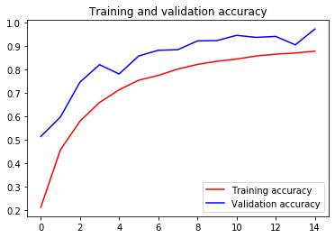

```python
# ATTENTION: Please do not alter any of the provided code in the exercise. Only add your own code where indicated
# ATTENTION: Please do not add or remove any cells in the exercise. The grader will check specific cells based on the cell position.
# ATTENTION: Please use the provided epoch values when training.

import csv
import numpy as np
import tensorflow as tf
from tensorflow.keras.preprocessing.image import ImageDataGenerator
from os import getcwd
```


```python
def get_data(filename):
  # You will need to write code that will read the file passed
  # into this function. The first line contains the column headers
  # so you should ignore it
  # Each successive line contians 785 comma separated values between 0 and 255
  # The first value is the label
  # The rest are the pixel values for that picture
  # The function will return 2 np.array types. One with all the labels
  # One with all the images
  #
  # Tips: 
  # If you read a full line (as 'row') then row[0] has the label
  # and row[1:785] has the 784 pixel values
  # Take a look at np.array_split to turn the 784 pixels into 28x28
  # You are reading in strings, but need the values to be floats
  # Check out np.array().astype for a conversion
    with open(filename) as training_file:
      # Your code starts here
      csv_reader = csv.reader(training_file,delimiter=',')
      first_line = True
      temp_images = []
      temp_labels = []
      for row in csv_reader:
        if first_line:
          first_line = False
        else:
          temp_labels.append(row[0])
          image = row[1:785]
          image_array = np.array_split(image,28)
          temp_images.append(image_array)
      images = np.array(temp_images).astype('float')
      labels = np.array(temp_labels).astype('float')
      # Your code ends here
    return images, labels


path_sign_mnist_train = f"{getcwd()}/../tmp2/sign_mnist_train.csv"
path_sign_mnist_test = f"{getcwd()}/../tmp2/sign_mnist_test.csv"
training_images, training_labels = get_data(path_sign_mnist_train)
testing_images, testing_labels = get_data(path_sign_mnist_test)

# Keep these
print(training_images.shape)
print(training_labels.shape)
print(testing_images.shape)
print(testing_labels.shape)

# Their output should be:
# (27455, 28, 28)
# (27455,)
# (7172, 28, 28)
# (7172,)
```

    (27455, 28, 28)
    (27455,)
    (7172, 28, 28)
    (7172,)


```python
# In this section you will have to add another dimension to the data
# So, for example, if your array is (10000, 28, 28)
# You will need to make it (10000, 28, 28, 1)
# Hint: np.expand_dims

training_images = np.expand_dims(training_images,axis=3)
testing_images = np.expand_dims(testing_images,axis=3)

# Create an ImageDataGenerator and do Image Augmentation
train_datagen = ImageDataGenerator(
    rescale = 1./255,
    height_shift_range = 0.2,
    width_shift_range = 0.2,
    shear_range = 0.2,
    zoom_range = 0.2,
    horizontal_flip = True,
    rotation_range = 40,
    fill_mode='nearest'
    )

validation_datagen = ImageDataGenerator(rescale=1./255)
    
# Keep These
print(training_images.shape)
print(testing_images.shape)
    
# Their output should be:
# (27455, 28, 28, 1)
# (7172, 28, 28, 1)
```

    (27455, 28, 28, 1)
    (7172, 28, 28, 1)


```python
# Define the model
# Use no more than 2 Conv2D and 2 MaxPooling2D
model = tf.keras.models.Sequential([
    tf.keras.layers.Conv2D(32,(3,3),activation='relu',input_shape=(28,28,1)),
    tf.keras.layers.MaxPooling2D(2,2),
    tf.keras.layers.Conv2D(64,(3,3),activation='relu'),
    tf.keras.layers.MaxPooling2D(2,2),
    tf.keras.layers.Flatten(),
    tf.keras.layers.Dense(512,activation='relu'),
    tf.keras.layers.Dense(26,activation='softmax')
    ])

# Compile Model. 
model.compile(optimizer='adam',
             loss='sparse_categorical_crossentropy',
             metrics=['acc'])

# Train the Model
history = model.fit_generator(train_datagen.flow(training_images,training_labels,batch_size=32),
                             steps_per_epoch = len(training_images)/32,
                             epochs=15,
                             validation_data=validation_datagen.flow(testing_images,testing_labels,batch_size=32),
                             validation_steps=len(testing_images)/32)

model.evaluate(testing_images, testing_labels, verbose=0)
```

    Epoch 1/15
    858/857 [==============================] - 65s 76ms/step - loss: 2.5755 - acc: 0.2107 - val_loss: 1.4534 - val_acc: 0.5138
    Epoch 2/15
    858/857 [==============================] - 65s 76ms/step - loss: 1.6982 - acc: 0.4565 - val_loss: 1.0415 - val_acc: 0.5970
    Epoch 3/15
    858/857 [==============================] - 65s 76ms/step - loss: 1.2948 - acc: 0.5792 - val_loss: 0.7717 - val_acc: 0.7465
    Epoch 4/15
    858/857 [==============================] - 65s 76ms/step - loss: 1.0307 - acc: 0.6593 - val_loss: 0.5339 - val_acc: 0.8212
    Epoch 5/15
    858/857 [==============================] - 63s 73ms/step - loss: 0.8667 - acc: 0.7137 - val_loss: 0.5661 - val_acc: 0.7814
    Epoch 6/15
    858/857 [==============================] - 63s 73ms/step - loss: 0.7419 - acc: 0.7546 - val_loss: 0.3995 - val_acc: 0.8583
    Epoch 7/15
    858/857 [==============================] - 62s 73ms/step - loss: 0.6706 - acc: 0.7752 - val_loss: 0.3218 - val_acc: 0.8829
    Epoch 8/15
    858/857 [==============================] - 62s 72ms/step - loss: 0.5941 - acc: 0.8024 - val_loss: 0.3118 - val_acc: 0.8854
    Epoch 9/15
    858/857 [==============================] - 62s 72ms/step - loss: 0.5430 - acc: 0.8223 - val_loss: 0.2196 - val_acc: 0.9229
    Epoch 10/15
    858/857 [==============================] - 62s 72ms/step - loss: 0.4912 - acc: 0.8359 - val_loss: 0.2032 - val_acc: 0.9244
    Epoch 11/15
    858/857 [==============================] - 63s 74ms/step - loss: 0.4591 - acc: 0.8454 - val_loss: 0.1482 - val_acc: 0.9467
    Epoch 12/15
    858/857 [==============================] - 67s 78ms/step - loss: 0.4213 - acc: 0.8583 - val_loss: 0.1936 - val_acc: 0.9381
    Epoch 13/15
    858/857 [==============================] - 66s 77ms/step - loss: 0.4036 - acc: 0.8663 - val_loss: 0.1744 - val_acc: 0.9421
    Epoch 14/15
    858/857 [==============================] - 64s 75ms/step - loss: 0.3872 - acc: 0.8712 - val_loss: 0.2439 - val_acc: 0.9062
    Epoch 15/15
    858/857 [==============================] - 62s 73ms/step - loss: 0.3569 - acc: 0.8790 - val_loss: 0.0926 - val_acc: 0.9736


    [100.69902256435346, 0.7714724]


```python
# Plot the chart for accuracy and loss on both training and validation
%matplotlib inline
import matplotlib.pyplot as plt
acc = history.history['acc']
val_acc = history.history['val_acc']
loss = history.history['loss']
val_loss = history.history['val_loss']

epochs = range(len(acc))

plt.plot(epochs, acc, 'r', label='Training accuracy')
plt.plot(epochs, val_acc, 'b', label='Validation accuracy')
plt.title('Training and validation accuracy')
plt.legend()
plt.figure()

plt.plot(epochs, loss, 'r', label='Training Loss')
plt.plot(epochs, val_loss, 'b', label='Validation Loss')
plt.title('Training and validation loss')
plt.legend()

plt.show()
```





# Submission Instructions


```python
# Now click the 'Submit Assignment' button above.
```

# When you're done or would like to take a break, please run the two cells below to save your work and close the Notebook. This will free up resources for your fellow learners. 


```javascript
%%javascript
<!-- Save the notebook -->
IPython.notebook.save_checkpoint();
```


```javascript
%%javascript
IPython.notebook.session.delete();
window.onbeforeunload = null
setTimeout(function() { window.close(); }, 1000);
```
